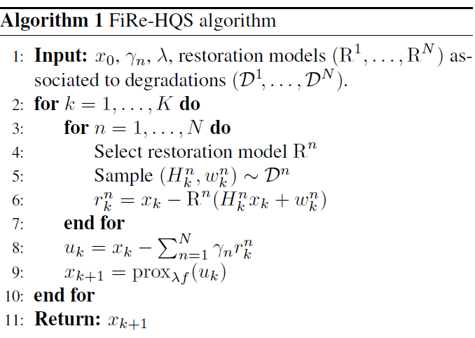

# FiRe: Fixed-Point Iteration for Image Restoration

[](https://arxiv.org/abs/2411.18970)

[Matthieu Terris](https://matthieutrs.github.io/), [Ulugbek S. Kamilov](https://ukmlv.github.io/), [Thomas Moreau](https://tommoral.github.io/about.html).

This repository contains the official implementation of CVPR 2025 paper "FiRe: Fixed-Point Iteration for Image Restoration". 
This work introduces a novel approach to image restoration from the viewpoint of fixed-point iteration.

 

# Résumé de l'article
Dans le contexte de la restauration d'images, l'article présente un framework qui prone l'utilisation de tout modèle de restauration couplé à un opérateur de dégradation associé, au lieu d'utiliser les modèles de débruitage, si plebiscités, comme des a priori représentant des images naturelles.Dans le cas d'un algorithme Plug-and-Play qui utilise un réseau préentrainé débruiteur, ce dernier devrait encoder la distribution des images naturelles (a priori). Néanmoins, le problème d'utiliser un débruiteur comme a priori, c'est que lorsque l'algorithme arrive à la convergence, l'image en entrée ne ressemble plus du tout aux images bruitées de son entraînement. Alors, l'action du débruiteur ne correspond plus au score réel $\nabla{\log p_{\sigma}(y)}=\frac{R(y)-y}{\sigma^2}$ nécessaire pour reconstruire l'image. Le décalage crée donc des artefacts sur la solution donnée par l'algorithme PnP.Au lieu de compter sur un débruiteur pour estimer le score d'une image pure, FiRe utilise la distance par rapport à l'état où l'image est stable après avoir subi une dégradation couplée à une restauration. Cela garantit que, même à la convergence, l'action du modèle reste cohérente avec la structure des images naturelles.Le résultat d'application de cette approche donne des images restaurées lisses, non pas par la qualité perceptuelle floue mais par sa qualité d'image naturelle qui ne contienne pas de défauts hautes fréquences comme les artefacts dus à un grand niveau de compression jpeg ou bien au bruit blanc.

# Description de la méthode
Pour un problème de restauration générale: $y = H\,x + w$ ,où $H$ est l'operateur linéaire et w répresente le bruit additif; la fonction objectif standard à minimiser pour tout modèle de restauration supervisé est: $L(\theta)=E_{x \sim pdata,w\sim W} \|R_\theta(H x + w) - x\|$ 

La méthodologie proposée par l'article définit un ensemble $C= \{x  \in  {R^n} |R(D(x)) = x \}$ 
de points fixes de la composition $T=RoD$ avec $R$  le modèle de restauration et  $D = (H · +w)$ sa dégradation associée(lors de l'entrainement de $R$).

En minimisant la fonction objectif, on s'assure que les images restaurées soient proches de l'ensemble de points fixes C.
Alors le terme de régularisation devient $f(x)=\frac{1}{2}d_C^2(x)$ ,ce qui définit un prior basée sur la distance à l'ensemble de points fixes C dont le gradient ou "la direction" vers laquelle corriger l'image devient  $\frac{1}{2} \nabla d_C^2(x) = x - R(D(x))$ 

L'implémenation de l'algorithme complet devient donc:


Les entrées sont: 
- $x_0$:Image dégradée
- Modèles de restauration $(R^1, \dots, R^N)$ : Des réseaux de neurones entraînés
- Dégradations associées $({D}^1,\dots,{D}^N)$:Le type de dégradation que le modèle de restauration ${R ^i}$ a appris à corriger leur de son entraînement 
- Paramètres $\gamma_n$ et $\lambda$ : Des coefficients qui règlent l'importance de chaque modèle et la fidélité aux données réelles.
  
    1. On simule dégradation $D^n$ par l'opérateur $H_k^n$ et le bruit $w_k^n$ pour lequel le modèle $n$ a été conçu 
    2. On passe la version dégradée artificiellement dans le modèle $R^n$ et on calcule le résidu $r_k^n$ qui est la différence $x_k - R^n(D^n(x_k))$.
    3. A la ligne 8,on obtient une image intermédiaire avec les combinant les corrections de chaque modèle
    4. La mise à jour de l'image se fait à la ligne 9 appliquant l'opérateur proximal
      

## Code
To reproduce the experiments, first download the test datasets and place them in your data folder. Next, update the `config/config.json` file to point to the correct data folder. There, there are two folders to specify:
- `ROOT_DATASET`: the folder within which the [CBSD68](https://huggingface.co/datasets/deepinv/CBSD68) and [set3c](https://huggingface.co/datasets/deepinv/set3c) datasets are located;
- `ROOT_CKPT`: the path to the folder containing the pre-trained models.

Then, you can run the following scripts to reproduce the experiments:

### Single restoration prior

```bash
python run_baselines.py --problem='gaussian_blur' --method_name='GD_swinir_2x' --dataset_name='set3c' --noise_level=0.01 --sigma_noise_max=0.01 --max_iter=60 --lambd=50 --eq=0
```

<details>
<summary><strong>Motion deblurring prior</strong> (click to expand) </summary>

```bash
python run_baselines.py --problem='gaussian_blur' --method_name='GD_restormer_motion' --dataset_name='set3c' --noise_level=0.01 --l_value=0.6 --sigma_blur_value=1. --max_iter=60 --gamma=0.5 --motion_sigma_noise=0.005 --lambd=50 --eq=1 --results_folder='results_single_prior/'
python run_baselines.py --problem='motion_blur' --method_name='GD_restormer_motion' --dataset_name='set3c' --noise_level=0.01 --l_value=0.6 --sigma_blur_value=1. --max_iter=60 --gamma=1.0 --motion_sigma_noise=0.005 --lambd=20 --eq=1 --results_folder='results_single_prior/'
python run_baselines.py --problem='SRx4' --method_name='GD_restormer_motion' --dataset_name='set3c' --noise_level=0.01 --l_value=0.6 --sigma_blur_value=1. --max_iter=60 --gamma=1.0 --motion_sigma_noise=0.005 --lambd=50 --eq=1 --results_folder='results_single_prior/'
```
</details>

<details>
<summary><strong>Gaussian deblurring prior</strong> (click to expand) </summary>

```bash
python run_baselines.py --problem='gaussian_blur' --method_name='GD_restormer_gaussian' --dataset_name='set3c' --noise_level=0.01 --sigma_blur_min=0.01 --sigma_blur_max=3.0 --max_iter=60 --gamma=1.0 --motion_sigma_noise=0.005 --lambd=20 --results_folder='results_single_prior/'
python run_baselines.py --problem='motion_blur' --method_name='GD_restormer_gaussian' --dataset_name='set3c' --noise_level=0.01 --sigma_blur_min=0.01 --sigma_blur_max=1.0 --max_iter=60 --gamma=1.0 --motion_sigma_noise=0.05 --lambd=20 --results_folder='results_single_prior/'
python run_baselines.py --problem='SRx4' --method_name='GD_restormer_gaussian' --dataset_name='set3c' --noise_level=0.01 --sigma_blur_min=0.01 --sigma_blur_max=4.0 --max_iter=60 --gamma=1.0 --motion_sigma_noise=0.02 --lambd=20 --results_folder='results_single_prior/'
```
</details>

<details>
<summary><strong>Super resolution x2 / x3 prior</strong> (click to expand) </summary>

For SRx2:
```bash
python run_baselines.py --problem='gaussian_blur' --method_name='GD_swinir_2x' --dataset_name='set3c' --noise_level=0.01 --sigma_noise_max=0.01 --max_iter=60 --lambd=50 --eq=0 --results_folder='results_single_prior/'
python run_baselines.py --problem='motion_blur' --method_name='GD_swinir_2x' --dataset_name='set3c' --noise_level=0.01 --sigma_noise_max=0.01 --max_iter=60 --lambd=100 --eq=0 --results_folder='results_single_prior/'
python run_baselines.py --problem='SRx4' --method_name='GD_swinir_2x' --dataset_name='set3c' --noise_level=0.01 --sigma_noise_max=0.01 --max_iter=60 --lambd=50 --eq=0 --results_folder='results_single_prior/'
```

For SRx3:
```bash
python run_baselines.py --problem='gaussian_blur' --method_name='GD_swinir_2x' --dataset_name='set3c' --noise_level=0.01 --sigma_noise_max=0.01 --max_iter=60 --lambd=50 --eq=0 --results_folder='results_single_prior/'
python run_baselines.py --problem='motion_blur' --method_name='GD_swinir_2x' --dataset_name='set3c' --noise_level=0.01 --sigma_noise_max=0.01 --max_iter=60 --lambd=100 --eq=0 --results_folder='results_single_prior/'
python run_baselines.py --problem='SRx4' --method_name='GD_swinir_2x' --dataset_name='set3c' --noise_level=0.01 --sigma_noise_max=0.01 --max_iter=60 --lambd=50 --eq=0 --results_folder='results_single_prior/'
```
</details>

<details>
<summary><strong>de-JPEG/denoising prior</strong> (click to expand) </summary>

```bash
srun python run_baselines.py --problem='gaussian_blur' --method_name='GD_scunet_jpeg' --dataset_name='set3c' --noise_level=0.01 --sigma_noise_min=0.0 --sigma_noise_max=0.1 --quality_min=40 --quality_max=80 --lambd=20 --max_iter=60 --results_folder='results_single_prior/'
srun python run_baselines.py --problem='motion_blur' --method_name='GD_scunet_jpeg' --dataset_name='set3c' --noise_level=0.01 --sigma_noise_min=0.0 --sigma_noise_max=0.01 --quality_min=40 --quality_max=80 --lambd=20 --max_iter=60 --results_folder='results_single_prior/'
srun python run_baselines.py --problem='SRx4' --method_name='GD_scunet_jpeg' --dataset_name='set3c' --noise_level=0.01 --sigma_noise_min=0.05 --sigma_noise_max=0.05 --quality_min=20 --quality_max=60 --lambd=50 --max_iter=80 --results_folder='results_single_prior/'
```
</details>

<details>
<summary><strong>Inpainting prior</strong> (click to expand) </summary>

```bash
python run_baselines.py --problem='gaussian_blur' --method_name='GD_lama' --dataset_name='set3c' --p_mask_min=0.6 --p_mask_max=0.6 --sigma_noise_max=0.0 --lambd=50 --gamma=0.6 --max_iter=20 --equivariant=0 --results_folder='results_single_prior/'
python run_baselines.py --problem='motion_blur' --method_name='GD_lama' --dataset_name='set3c' --p_mask_min=0.6 --p_mask_max=0.6 --sigma_noise_max=0.0 --lambd=20 --gamma=0.6 --max_iter=20 --equivariant=0 --results_folder='results_single_prior/'
python run_baselines.py --problem='SRx4' --method_name='GD_lama' --dataset_name='set3c' --p_mask_min=0.6 --p_mask_max=0.6 --sigma_noise_max=0.0 --lambd=50 --gamma=0.8 --max_iter=20 --equivariant=0 --results_folder='results_single_prior/'
```
</details>

### Combining priors
The above interpretation suggests that multiple restoration priors can be combined by simply averaging their outputs.
To do so, we can use the `--list_gamma_values` argument to specify the $\gamma$ values for each prior.
We observed that a good choice for combined priors is to use (a) the SCUNet de-JPEG prior, (b) the gaussian deblurring prior, and (c) the SR prior.

To run the combined prior experiments, you can use the following commands:

```bash
python run_baselines.py --problem='SRx4' --method_name='GD_multi_scunet_denoise_restormer_gaussian_swinir_3x' --dataset_name='set3c' --noise_level=0.01 --sigma_blur_min=0.01 --sigma_blur_max=0.1 --max_iter=30 --list_gamma_values 1.5 0.25 1.25 --motion_sigma_noise=0.005 --sigma_noise_min=0.0 --sigma_noise_max=0.1 --lambd=100 --results_folder='results_multiprior/' --equivariant=0
```

## 📝 Citation

If you find this work useful for your research, please cite our paper:

```bibtex
@inproceedings{terris2025fire,
  title={FiRe: Fixed-points of restoration priors for solving inverse problems},
  author={Terris, Matthieu and Kamilov, Ulugbek S and Moreau, Thomas},
  booktitle={Proceedings of the Computer Vision and Pattern Recognition Conference},
  pages={23185--23194},
  year={2025}
}
```
